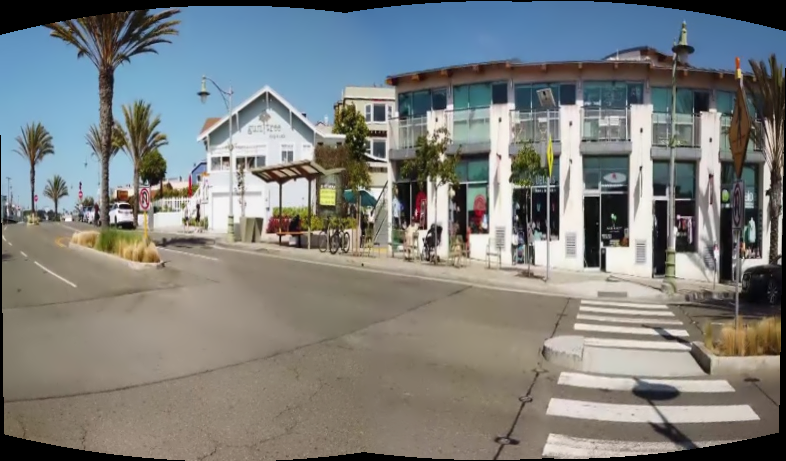
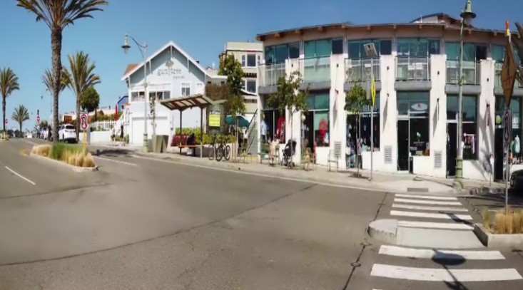

# Image Fusion (Image Stitching) 

This is the code part of an implementation project in IEMS5707 course. 

## Project Structure  
.  
├── README.md  
├── images  
│   ├── large_parallax  
│   ├── low_overlap  
│   └── standard  
├── log.txt  
├── results  
│   ├── large_parallax  
│   ├── low_overlap  
│   └── standard  
├── stitch_cv2.py  
└── stitching_detailed.py  

The directories under ./images folder contain the image slices to be stitched.   
The directories under ./results folder contain the stitching result.  
log.txt records the types of algorithms and time-consuming.  
stitching_detailed.py is our main program.
## Requirements
```
imutils==0.5.4
numpy==1.21.2
opencv_python==4.5.5.64
```

## Usage
```
usage: stitching_detailed.py [-h] [--try_cuda TRY_CUDA] [--work_megapix WORK_MEGAPIX]
                             [--features {orb,sift,brisk,akaze}] [--matcher {homography,affine}]
                             [--estimator {homography,affine}] [--match_conf MATCH_CONF] [--conf_thresh CONF_THRESH]
                             [--ba {ray,reproj,affine,no}] [--ba_refine_mask BA_REFINE_MASK]
                             [--wave_correct {horiz,no,vert}] [--save_graph SAVE_GRAPH]
                             [--warp {spherical,plane,affine,cylindrical,fisheye,stereographic,compressedPlaneA2B1,compressedPlaneA1.5B1,compressedPlanePortraitA2B1,compressedPlanePortraitA1.5B1,paniniA2B1,paniniA1.5B1,paniniPortraitA2B1,paniniPortraitA1.5B1,mercator,transverseMercator}]
                             [--seam_megapix SEAM_MEGAPIX] [--seam {dp_color,dp_colorgrad,voronoi,no}]
                             [--compose_megapix COMPOSE_MEGAPIX]
                             [--expos_comp {gain_blocks,gain,channel,channel_blocks,no}]
                             [--expos_comp_nr_feeds EXPOS_COMP_NR_FEEDS]
                             [--expos_comp_nr_filtering EXPOS_COMP_NR_FILTERING]
                             [--expos_comp_block_size EXPOS_COMP_BLOCK_SIZE] [--blend {multiband,feather,no}]
                             [--blend_strength BLEND_STRENGTH] [--output OUTPUT] [--timelapse TIMELAPSE]
                             [--rangewidth RANGEWIDTH] [--crop CROP]
                             img_dir_name

Rotation model images stitcher

positional arguments:
  img_dir_name          Path to input directory of images to stitch

optional arguments:
  -h, --help            show this help message and exit
  --try_cuda TRY_CUDA   Try to use CUDA. The default value is no. All default values are for CPU mode.
  --work_megapix WORK_MEGAPIX
                        Resolution for image registration step. The default is 0.6 Mpx
  --features {orb,sift,brisk,akaze}
                        Type of features used for images matching. The default is 'orb'.
  --matcher {homography,affine}
                        Matcher used for pairwise image matching. The default is 'homography'.
  --estimator {homography,affine}
                        Type of estimator used for transformation estimation. The default is 'homography'.
  --match_conf MATCH_CONF
                        Confidence for feature matching step. The default is 0.3 for ORB and 0.65 for other feature
                        types.
  --conf_thresh CONF_THRESH
                        Threshold for two images are from the same panorama confidence.The default is 1.0.
  --ba {ray,reproj,affine,no}
                        Bundle adjustment cost function. The default is 'ray'.
  --ba_refine_mask BA_REFINE_MASK
                        Set refinement mask for bundle adjustment. It looks like 'x_xxx', where 'x' means refine
                        respective parameter and '_' means don't refine, and has the following
                        format:<fx><skew><ppx><aspect><ppy>. The default mask is 'xxxxx'. If bundle adjustment doesn't
                        support estimation of selected parameter then the respective flag is ignored.
  --wave_correct {horiz,no,vert}
                        Perform wave effect correction. The default is 'horiz'
  --save_graph SAVE_GRAPH
                        Save matches graph represented in DOT language to <file_name> file.
  --warp {spherical,plane,affine,cylindrical,fisheye,stereographic,compressedPlaneA2B1,compressedPlaneA1.5B1,compressedPlanePortraitA2B1,compressedPlanePortraitA1.5B1,paniniA2B1,paniniA1.5B1,paniniPortraitA2B1,paniniPortraitA1.5B1,mercator,transverseMercator}
                        Warp surface type. The default is 'spherical'.
  --seam_megapix SEAM_MEGAPIX
                        Resolution for seam estimation step. The default is 0.1 Mpx.
  --seam {dp_color,dp_colorgrad,voronoi,no}
                        Seam estimation method. The default is 'dp_color'.
  --compose_megapix COMPOSE_MEGAPIX
                        Resolution for compositing step. Use -1 for original resolution. The default is -1
  --expos_comp {gain_blocks,gain,channel,channel_blocks,no}
                        Exposure compensation method. The default is 'gain_blocks'.
  --expos_comp_nr_feeds EXPOS_COMP_NR_FEEDS
                        Number of exposure compensation feed.
  --expos_comp_nr_filtering EXPOS_COMP_NR_FILTERING
                        Number of filtering iterations of the exposure compensation gains.
  --expos_comp_block_size EXPOS_COMP_BLOCK_SIZE
                        BLock size in pixels used by the exposure compensator. The default is 32.
  --blend {multiband,feather,no}
                        Blending method. The default is 'multiband'.
  --blend_strength BLEND_STRENGTH
                        Blending strength from [0,100] range. The default is 5
  --output OUTPUT       The default is 'result.jpg'
  --timelapse TIMELAPSE
                        Output warped images separately as frames of a time lapse movie, with 'fixed_' prepended to
                        input file names.
  --rangewidth RANGEWIDTH
                        uses range_width to limit number of images to match with.
```
## Example
For example, if we would like to stitch three images in ./images/low_overlap:  


Set output to ./results/low_overlap/output_orb_lowOverlap.png, use ORB feature detector, with cropping.  
`python stitching_detailed.py ./images/low_overlap --output ./results/low_overlap/output_orb_lowOverlap.png --features orb --crop 1 `  
```
SURF not available
./images/low_overlap
['./images/low_overlap/1.jpg', './images/low_overlap/2.jpg', './images/low_overlap/3.jpg']
[INFO] cropping...
Done
```
There will be two output files in ./result/low_overlap, one with cropping, one without:  



New records added in log.txt:  
`orb:285.9828472137451ms`


## Reference Project
https://github.com/opencv/opencv/blob/master/samples/python/stitching_detailed.py